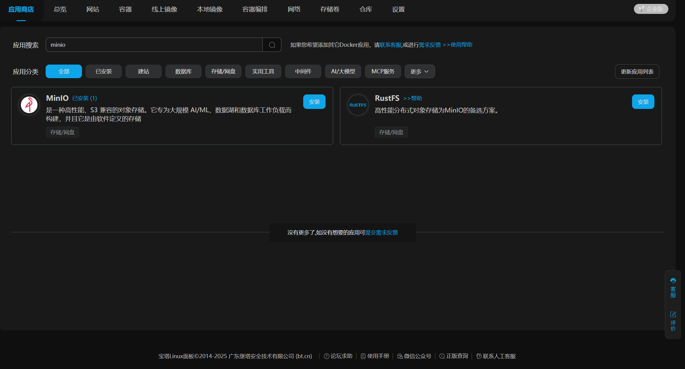
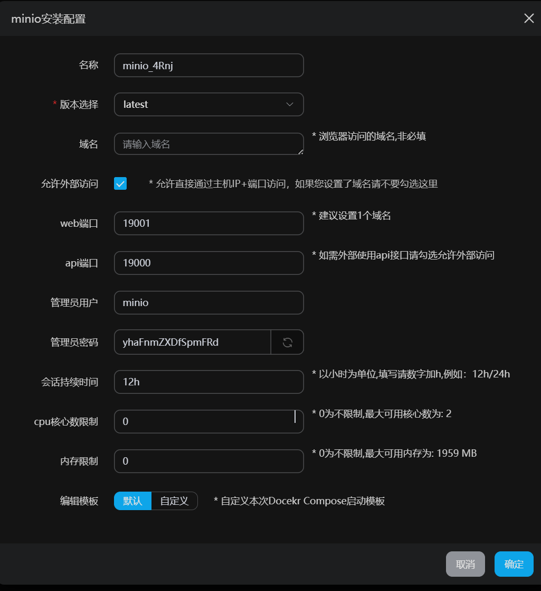
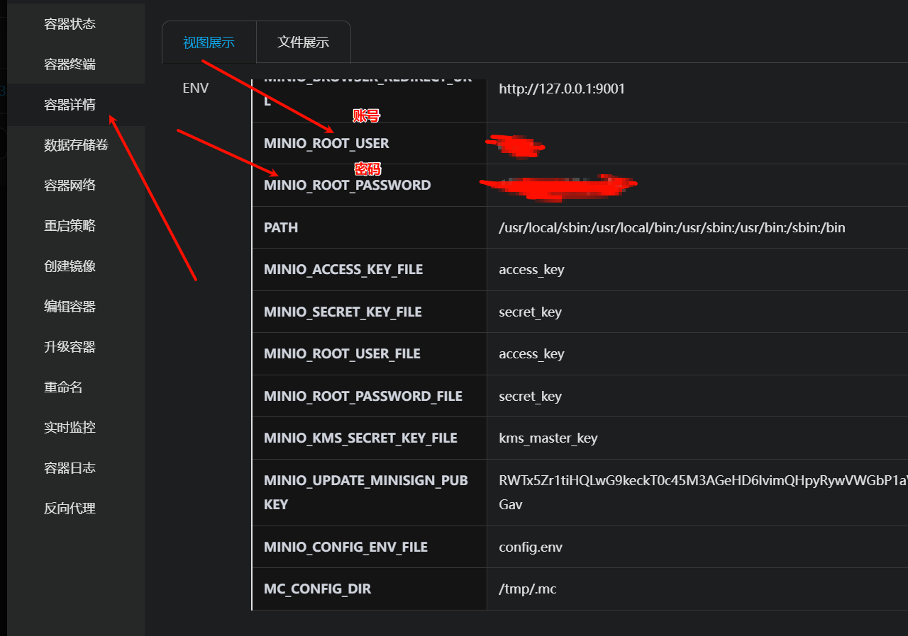
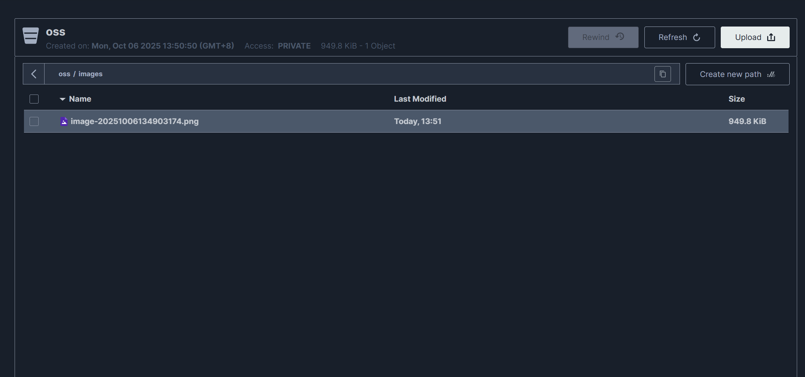

# minio使用

## 安装minio

> 使用宝塔的Docker一键安装minio，并在安全组中添加映射出来的端口

在docker应用商城搜索minio并安装


设置选择默认的，直接安装


## 登录

在容器管理界面点击管理容器再点击容器详细查看账号和密码


输入账号密码登录即可


## 上传

创建文件夹并上传图片



目前bucket是private，不能通过浏览器直接访问，想要改为public需要使用mc命令

1. 下载mc

```
wget https://dl.min.io/client/mc/release/linux-amd64/mc
chmod +x mc
sudo mv mc /usr/local/bin/
```

2.  添加本地 MinIO 别名

```
mc alias set local http://<服务器IP>:19000 admin admin123
```

> 如果你是本机访问，可用 `http://127.0.0.1:19000`

3. 设置桶为公开下载

```
mc anonymous set download local/mybucket
```

4. 访问资源(xxx为服务器公网ip)

   http://xxx:19000/oss/image-20251006134903174.png