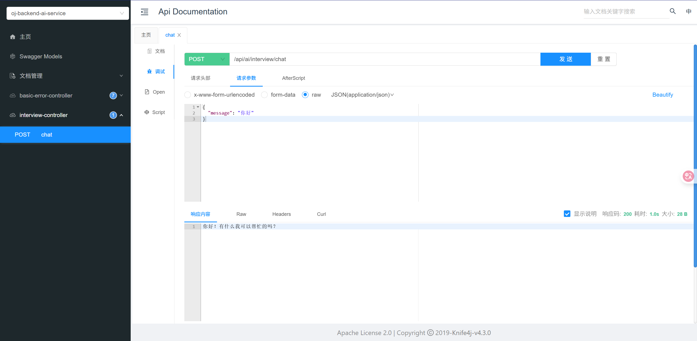

# JDK8项目中引入千问AI

因为SpringAI和JDK17绑定，所以不能够使用SpringAI，只能通过HTTP请求来完成对大模型的调用

1)引入千问SDK

```
<dependency>
    <groupId>com.alibaba</groupId>
        <artifactId>dashscope-sdk-java</artifactId>
        <version>2.21.1</version>
        <exclusions>
           <exclusion>
               <groupId>org.slf4j</groupId>
                <artifactId>slf4j-simple</artifactId>
                </exclusion>
           </exclusions>
 </dependency>
```

2)配置API

```
ai:
  dashscope:
    api-key: sk-xxxx
```

3)定义通用调用AI的方法

```java
@Component
public class AiManager {

    private static final Logger log = LoggerFactory.getLogger(AiManager.class);

    @Value("${ai.dashscope.api-key}")
    private String apiKey;

    public String doChat(String userMessage) throws NoApiKeyException, InputRequiredException, ApiException {
        // 终极调试：打印即将使用的 API Key
        log.info("Attempting to use DashScope API Key: '{}'", apiKey);

        // 在新版SDK中，仍然建议在调用前设置API Key
        Constants.apiKey = apiKey;
        Generation gen = new Generation();

        // 1. 创建消息列表
        Message systemMsg = Message.builder().role(Role.SYSTEM.getValue()).content("You are a helpful assistant.").build();
        Message userMsg = Message.builder().role(Role.USER.getValue()).content(userMessage).build();

        // 2. 构建请求参数，替代旧的 MessageManager
        GenerationParam param = GenerationParam.builder()
                .model(Generation.Models.QWEN_PLUS) // 指定模型，例如 qwen-plus
                .messages(Arrays.asList(systemMsg, userMsg)) // 将消息列表传入
                .resultFormat(GenerationParam.ResultFormat.MESSAGE) // 设置返回格式为消息
                .build();

        // 3. 调用并获取结果
        GenerationResult result = gen.call(param);
        return result.getOutput().getChoices().get(0).getMessage().getContent();
    }
}
```

4）写Controller层，进行网络交互

```java
@RestController
@RequestMapping("/interview")
public class InterviewController {

    @Resource
    private AiManager aiManager;

    @PostMapping("/chat")
    public String chat(@RequestBody Map<String, String> request) {
        String message = request.get("message");
        if (message == null || message.isEmpty()) {
            return "消息不能为空";
        }
        try {
            return aiManager.doChat(message);
        } catch (Exception e) {
            // 在实际应用中，这里应该记录更详细的日志
            e.printStackTrace();
            return "AI 服务调用失败";
        }
    }
}
```

5)Swagger测试
